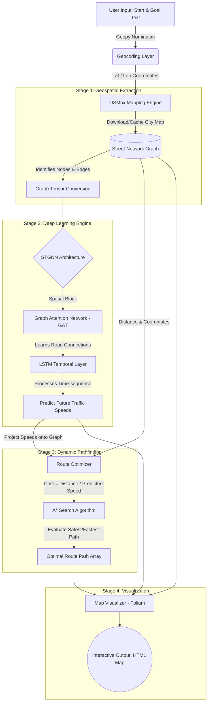

# Traffic-GNN: Dynamic Traffic Prediction & Route Optimization

> **Spatio-Temporal Graph Neural Networks (STGNN) on Real-World Maps** 🌍📈

An end-to-end Machine Learning pipeline that predicts future traffic speeds and dynamically optimizes city routes using a hybrid **Spatio-Temporal Graph Neural Network** architecture (GAT + LSTM) alongside OpenStreetMap integration.

---

## 🌟 Overview

Traditional routing algorithms calculate the shortest path based on **static distances**. However, real-world travel relies heavily on **dynamic traffic conditions**.

This system uses Graph Neural Networks to ingest historical traffic context, predict what traffic will look like in the future, and layer those speed predictions over city graphs to run intelligent route optimization (A\* Search).

### 🎯 Key Features

- 🧠 **Spatio-Temporal Prediction Model:** Combines Graph Attention Networks (GAT) to understand spatial road topology and Long Short-Term Memory (LSTM) layers to capture time dynamics.
- 🗺️ **Real-World Map Integration:** Automatically pulls city street networks (e.g., Indore, India) via `osmnx`.
- 📍 **Robust Geocoding:** Translates natural language places (e.g., `"Rajwada, Indore"`) to precise GPS coordinates.
- 🚦 **Graph-Based Routing:** Derives dynamic edge limits, adjusting constraints based on traffic node capacity, and solves for the most efficient path.
- 📊 **Interactive Heatmaps:** Generates interactive [Folium](https://python-visualization.github.io/folium/) HTML maps demonstrating node-level predictions and optimal routes.

---

## 🏗️ Architecture & Pipeline

The pipeline consists of **four major stages**: Geospatial Extraction → Deep Learning → Route Optimization → Visualization.



---

## 🔬 Stage-by-Stage Breakdown

### Stage 1 — Spatial Structure & Graph Build

To run predictions on a map, we need a mathematical graph representation of the streets:

- Uses **OpenStreetMap** via `osmnx` to download a drive network for a given city.
- Every intersection becomes a **Node** and every road segment becomes an **Edge**.
- Translates starting points (e.g., `"Airport"`) and destinations to the nearest graph nodes dynamically.

### Stage 2 — Spatio-Temporal Graph Neural Network (STGNN)

The core intelligence engine designed to process tensors of shape `[Batch, Time, Nodes, Features]`:

| Component | File | Role |
|---|---|---|
| **Spatial Block (GAT)** | `models/gat_conv.py` | Attends to congested neighbor nodes with dynamic weights |
| **Temporal Block (LSTM)** | `models/temporal.py` | Learns traffic sequences across time steps (T, T+15m, T+30m...) |

> Unlike static GCN convolutions, GAT allows the network to **"attend"** — giving more weight to heavily congested adjacent nodes rather than treating all connecting roads equally.

### Stage 3 — Dynamic Optimization Pathing (A\*)

- The STGNN generates a **predicted speed tensor** for every road in the city.
- The `RouteOptimizer` maps predicted speeds + Haversine distances → realistic **travel time per edge**.
- **A\* Search** explores the graph using dynamic travel times as weights and geographic distance as a heuristic, discovering the minimum-time path efficiently.

### Stage 4 — Visualization

- Results are rendered as an **interactive Folium HTML map**.
- Nodes are color-coded by predicted traffic speed (heatmap).
- The optimal route is overlaid as a highlighted polyline.

---

## 🚀 Quick Start

### Prerequisites

- Python 3.8+
- pip

### Installation

```bash
# Clone the repository
git clone <repository_url>
cd traffic-gnn

# Install dependencies
pip install -r requirements.txt
```

### Run Route Prediction

```bash
# Predict traffic globally and find the fastest route
python predict_indore.py \
  --start_loc "Devi Ahilyabai Holkar Airport, Indore" \
  --goal_loc "Musakhedi, Indore"
```

Once completed, open the output in your browser:

```bash
open visualizations/indore_custom_route.html
# or on Windows: start visualizations/indore_custom_route.html
```

---

## 📁 Project Structure

```
traffic-gnn/
│
├── models/
│   ├── gat_conv.py          # Graph Attention Network (Spatial Block)
│   ├── temporal.py          # LSTM Temporal Layer
│   └── stgnn.py             # Full STGNN Model
│
├── visualizations/          # Output HTML maps (generated)
│
├── predict_indore.py        # Main prediction + routing script
├── requirements.txt
└── README.md
```

---

## 📊 Evaluation Metrics

Traffic prediction models are evaluated across multiple time horizons:

| Metric | Description |
|---|---|
| **MAE** | Mean Absolute Error — average magnitude of prediction errors |
| **RMSE** | Root Mean Square Error — penalizes large deviations more heavily |
| **MAPE** | Mean Absolute Percentage Error — scale-independent relative error |

Evaluated at **15-minute**, **30-minute**, and **60-minute** prediction horizons.

---

## 📚 Core Concepts (Interview Prep)

<details>
<summary><strong>Why Graph Neural Networks (GNN) for traffic?</strong></summary>

Standard CNNs work on rigid grids (like images). City roads are **non-Euclidean structures** — irregular graphs with variable connectivity. A GNN naturally adapts to vertices (intersections) and edges (roads), allowing the ML model to pass "traffic messages" along connected pathways.

</details>

<details>
<summary><strong>GAT vs GCN — what's the difference?</strong></summary>

A traditional **GCN** uses static adjacency matrices to pool neighbor data. A **GAT** applies an Attention Mechanism, assigning dynamic weights to neighbor nodes — for example, recognizing that an accident on a main road impacts traffic far more than normal flow on a side street.

</details>

<details>
<summary><strong>Why A* over Dijkstra?</strong></summary>

A\* incorporates an **informed heuristic** (straight-line Haversine distance to the goal) to guide the search forward, dramatically reducing search time over large 60,000+ node city graphs compared to Dijkstra's blind exploration.

</details>

<details>
<summary><strong>How are predictions evaluated?</strong></summary>

Using **MAE**, **RMSE**, and **MAPE** across 15m, 30m, and 60m time horizons. Lower error at longer horizons indicates a more robust temporal model.

</details>

---

## 🧰 Tech Stack

| Tool | Purpose |
|---|---|
| `PyTorch` | STGNN model training & inference |
| `osmnx` | OpenStreetMap street network download |
| `geopy` | Nominatim geocoding |
| `folium` | Interactive HTML map generation |
| `networkx` | Graph data structures & A\* search |
| `numpy` | Tensor & matrix operations |

---

## 📄 License

This project is open source. See [LICENSE](LICENSE) for details.

---
